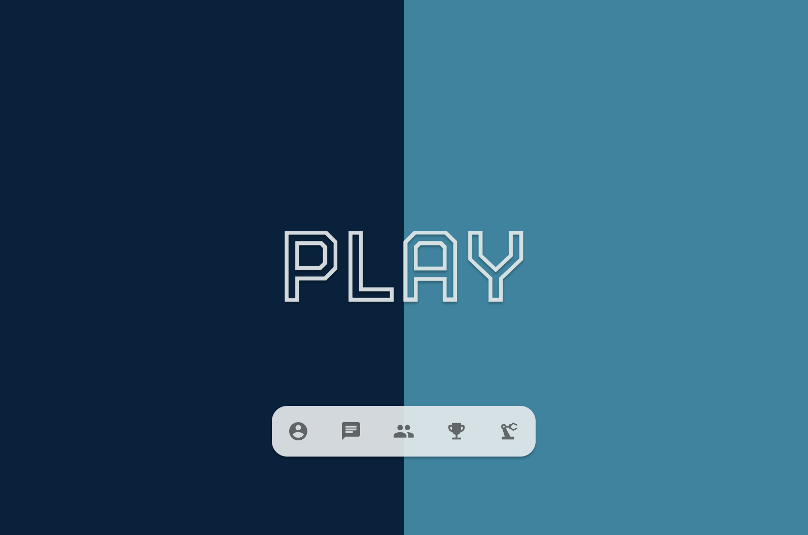
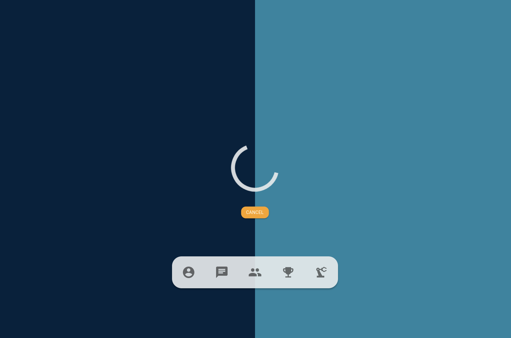
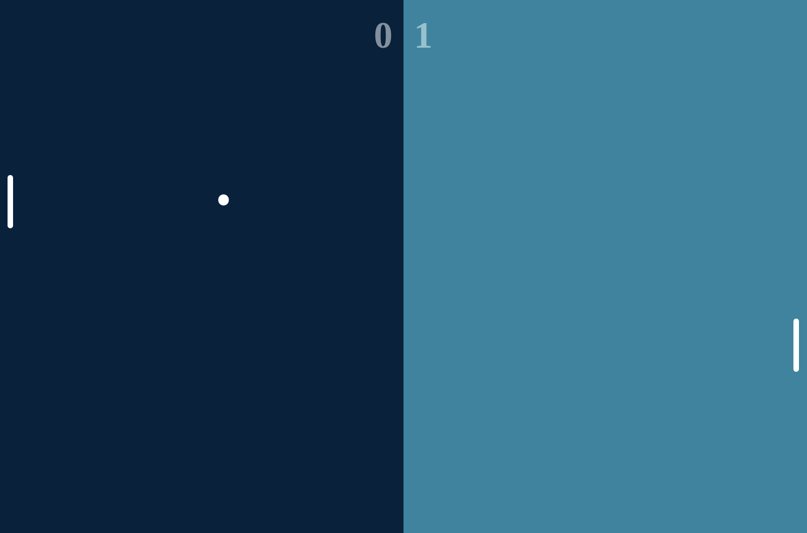
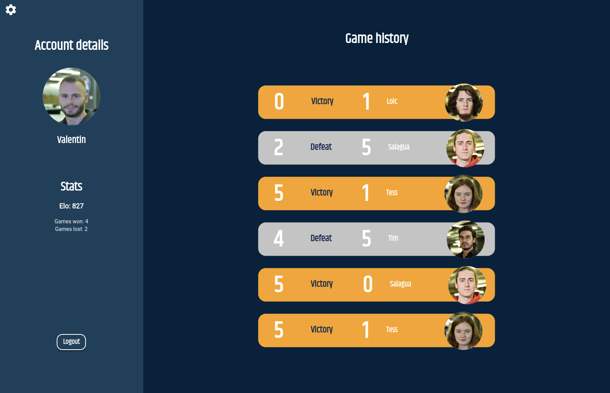
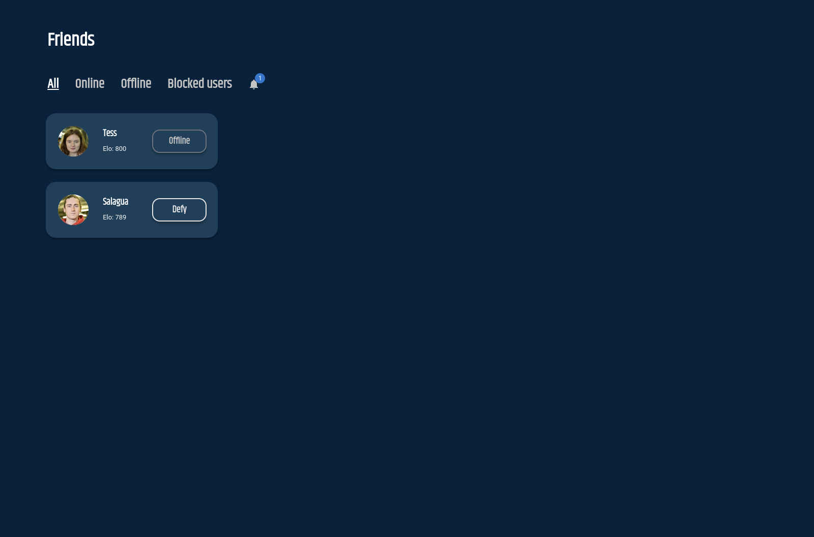
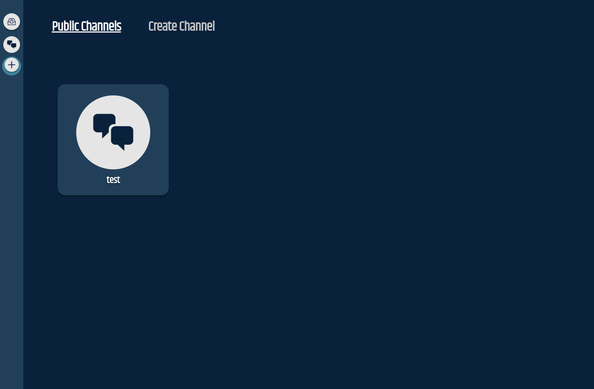
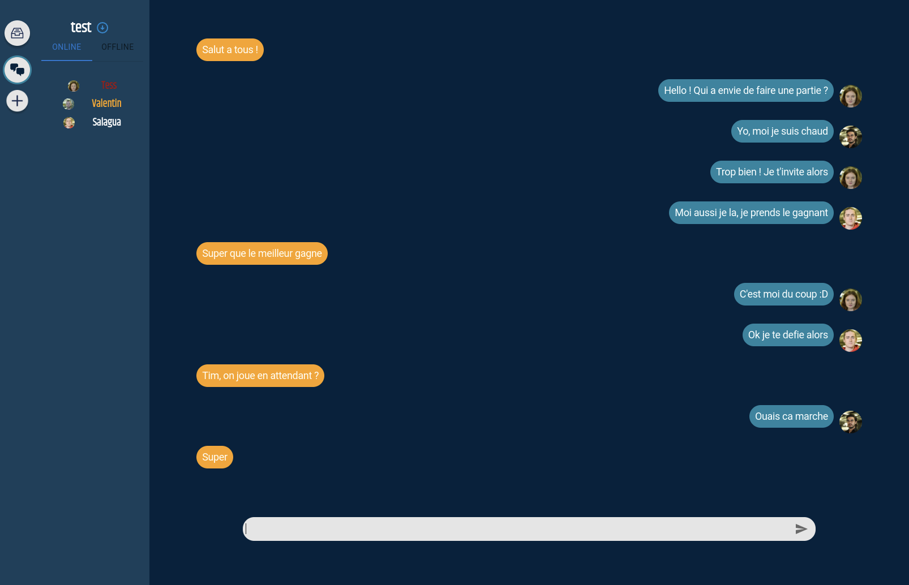
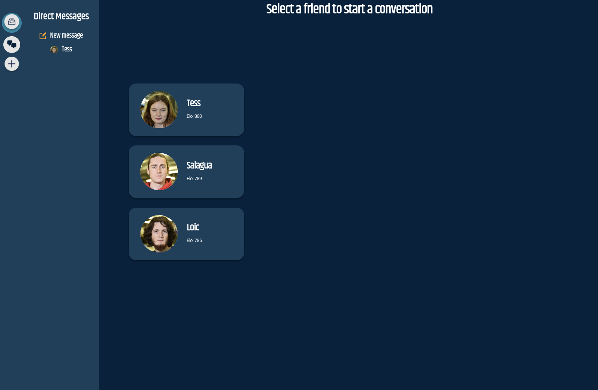
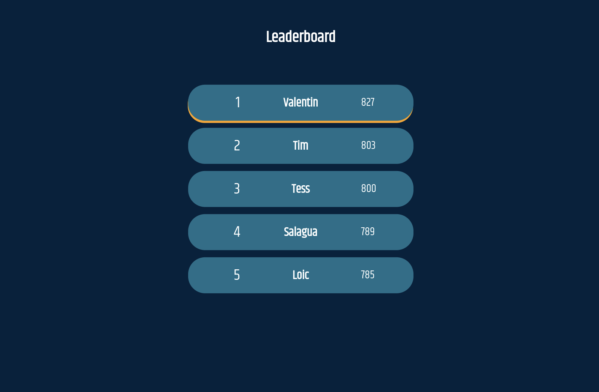

# Transcendance



This project is the very first web project we had to do at [42 Paris](https://42.fr/en/homepage/), and the last of the common core. We were required to build a Pong with online features, as a single page app.

## Features

- A [Pong](https://en.wikipedia.org/wiki/Pong) game based on the original arcade game released in 1972, with PvP and PvE modes.
- A social interface, to display and manage your friends list, show friends' status etc.
- A messaging interface with private chats, and public / private channels.
- A leaderboard with the highest scores.

## Built With

* [TypeScript](https://www.typescriptlang.org/) with [NextJS](https://nextjs.org/) (a [React](https://reactjs.org/) framework) - Frontend
* [TypeScript](https://www.typescriptlang.org/) with [NestJS](https://nestjs.com/) - Backend
* [PostGreSQL](https://www.postgresql.org/) - Database
* [Docker](https://www.docker.com/) 

## Run the project

⚠️ In order to test this project you must have access to the 42 API and edit the private and public keys in `.env` and `.env.private` ⚠️

Clone the repo and run the following command :

```
docker-compose up --build
```

## Design

Feel free to check our [Figma](https://www.figma.com/file/MmD9qKHpindbJGGaRwnkGh/Transcendance_final?node-id=0%3A1) for an overview of the frontend's expected look and feel.
We had a deadline to set the project as finished, so during development some elements of the design were left out in order to focus on a MVP.

## Screenshots


















## Authors

* [Pilouck](https://github.com/PiloucK/)
* [NotCampeur](https://github.com/NotCampeur)
* [masakiva](https://github.com/masakiva)
* [valentinllpz](https://github.com/valentinllpz)
